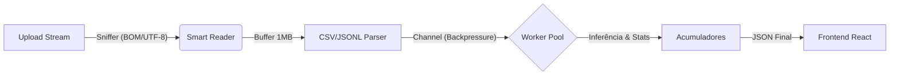

# 🚀 DataProfiler Enterprise

<p align="center">
  
  
  
  
</p>


[](https://jgustavocn.github.io/dataprofiler/)
[](https://github.com/JGustavoCN/dataprofiler/blob/main/LICENSE)
[](https://dataprofiler-jgustavocn.onrender.com)

> **Live Demo:** [https://dataprofiler-jgustavocn.onrender.com](https://dataprofiler-jgustavocn.onrender.com) > _Nota: Hospedado em plano gratuito (Render). Pode haver "Cold Start" de ~50s e limitações de CPU._

---

## 📖 Sobre o Projeto

O **DataProfiler** é um motor de ingestão e análise de dados de alta performance, desenhado para processar arquivos massivos (Gigabytes) com **alocação de memória constante** (O(1) Space Complexity).

Diferente de analisadores comuns que carregam o arquivo inteiro na memória (como o Pandas), este projeto utiliza uma arquitetura de **Streaming Pipeline** em Go. Isso permite que ele rode em ambientes hostis (containers com 512MB de RAM) processando arquivos de 10GB ou mais sem risco de _Out Of Memory (OOM)_.

O sistema foi desenvolvido com foco em **Logística e Big Data**, capaz de identificar padrões brasileiros (CNPJ, Placas, CEP) e inferir tipos de dados em tempo real.

---

## ⚙️ Arquitetura Técnica

O coração do sistema é um pipeline assíncrono baseado no padrão **Producer-Consumer**:



### Destaques de Engenharia (Under the Hood)

- **Zero-Allocation Parsing:** Uso intensivo de `sync.Pool` para reutilizar buffers de memória e reduzir a pressão no Garbage Collector (GC).
- **Smart Sniffing:** Detecta automaticamente o formato (CSV vs JSONL), o separador (`,`, `;`, `|`) e o encoding (UTF-8, UTF-16LE com BOM, Windows-1252) lendo apenas os primeiros bytes.
- **Concorrência Real:** Desacoplamento total entre a leitura de disco (I/O Bound) e a análise estatística (CPU Bound) usando Goroutines e Channels.
- **Single Binary Deployment:** O Frontend (React/Vite) é compilado e embutido dentro do binário Go usando `//go:embed`, facilitando a distribuição.

---

## ✨ Funcionalidades

### 🔍 Análise de Dados

- **Inferência de Tipos Contextual:** Distingue `Integer`, `Float`, `String`, `Boolean` e `Date`.
- **Detecção de Domínio (Logística/Fiscal):** Identifica automaticamente padrões complexos via Regex compilada:
- 🚛 **Logística:** Placa de Veículo (Mercosul/Antiga), Container ID.
- 🏢 **Fiscal:** CNPJ, CPF, Chave de Acesso (NFe/CTe).
- 📍 **Geral:** CEP, Email, Telefone.

- **Estatísticas On-the-Fly:** Calcula Min, Max, Média e Contagem de Nulos sem armazenar os valores.

### 🛡️ Robustez e UX

- **Feedback em Tempo Real:** Barra de progresso via **Server-Sent Events (SSE)**.
- **Resiliência a "Dados Sujos":** Relatório de "Dirty Lines" (linhas mal formatadas) sem interromper o processamento das linhas válidas.
- **Suporte Multi-Formato:** Aceita CSV e JSON Lines (.jsonl) nativamente.

---

## 🛠️ Tech Stack

### Backend (Go 1.25)

- **Stdlib First:** Uso majoritário da biblioteca padrão (`encoding/csv`, `net/http`, `sync/atomic`).
- **Structured Logging:** Observabilidade com `log/slog`.
- **Testing:** Fuzz Testing para validação de inputs caóticos.

### Frontend (React 19.2)

- **Vite + SWC:** Build tool de alta performance.
- **Material UI (MUI):** Interface corporativa focada em densidade de dados.
- **Recharts:** Visualização gráfica de histogramas e distribuições.

---

## 🏆 Benchmarks e Performance

Testes realizados em ambiente controlado (Docker com limite de memória rígido):

| Cenário         | Tamanho do Arquivo | Linhas       | Limite de RAM | Status                           |
| --------------- | ------------------ | ------------ | ------------- | -------------------------------- |
| **Básico**      | 1.0 GB             | ~12 Milhões  | **512 MB**    | ✅ Sucesso (Pico 12MB Heap)      |
| **Stress Test** | 10.0 GB            | ~120 Milhões | **512 MB**    | ✅ Sucesso (Streaming constante) |
| **Network**     | 765 MB (HTTP)      | ~9.5 Milhões | **512 MB**    | ✅ Sucesso                       |

_> O uso de memória permanece estável (~9MB a ~50MB) independente do tamanho do arquivo, provando a eficiência do algoritmo de streaming._

---

## 🚀 Como Rodar

### Opção 1: Docker (Recomendado)

A maneira mais limpa de rodar o projeto, isolando todas as dependências.

```bash
# 1. Subir a aplicação (Backend + Frontend)
docker compose up app

# Acessar: http://localhost:8080

```

### Opção 2: Compilação Manual (Devs)

Requer **Go 1.25+** e **Node.js 20+**.

```bash
# 1. Instalar dependências e ferramentas (incluindo rsrc para ícone Windows)
make setup

# 2. Rodar em modo de desenvolvimento (Hot Reload)
make run

# 3. Gerar Binário de Produção (Single Binary .exe)
make release

```

---

## 🗺️ Roadmap

- [x] **Milestone 1:** Core Profiling, Streaming Architecture e Docker Deploy.
- [ ] **Milestone 2:** Persistência de relatórios (SQLite/Postgres) e Histórico.
- [ ] **Milestone 3:** Comparação de Schemas (Data Drift).
- [ ] **Milestone 4:** Integração com APIs externas (ex: ReceitaWS para enriquecer CNPJ).

---

## 👨‍💻 Autor

Desenvolvido por **[JGustavoCN](https://github.com/JGustavoCN)**.

Projeto criado como estudo de caso avançado em **Engenharia de Software, Otimização de Performance e Arquitetura Cloud-Native**.
