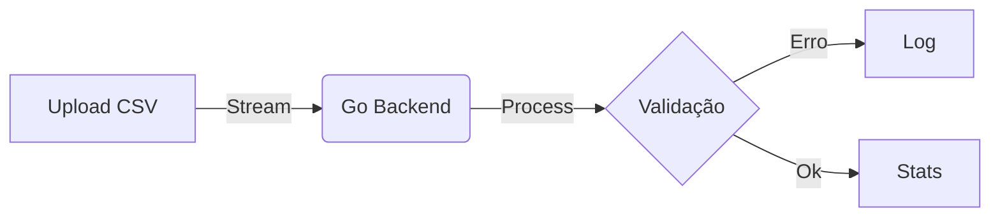

# Guia de Contribuição e Estilo

Este documento define os padrões técnicos, visuais e de redação para a documentação do **Data Profiler**.

Como utilizamos o _Material for MkDocs_ com extensões avançadas, é **obrigatório** seguir estas diretrizes para manter a consistência e o nível "Enterprise Grade" do projeto.

---

## 1. Princípios de Redação

### 1.1. Tom de Voz

A documentação deve ser técnica, impessoal e direta. Evite narrativas em primeira pessoa.

- ❌ **Incorreto (Pessoal/Coloquial):** "Aí o código pega o arquivo..." ou "Eu decidi usar Go porque..."
- ✅ **Correto (Técnico/Passivo):** "O sistema processa o arquivo visando otimização de I/O." ou "A decisão arquitetural baseou-se na latência."

### 1.2. Emojis e Ícones

- **Texto Corrido:** **Proibido** usar emojis coloridos (😎, 🚀, 🔥) no meio de frases ou títulos. Isso reduz a seriedade da documentação.
- **Admonitions e Botões:** Permitido o uso de ícones monocromáticos via sintaxe `:icon-name:`.
  - Exemplo: Use `:material-github:` para links de repositório.

### 1.3. Formatação de Texto

Utilize as extensões visuais para destacar elementos de interface ou termos chave.

- **Teclas de Atalho (`pymdownx.keys`):** Use para documentar atalhos da CLI ou do Dashboard.

  - Sintaxe: `++ctrl+c++` ou `++enter++`
  - Resultado: Renderiza uma tecla visual: ++ctrl+c++

- **Marcação de Texto (`pymdownx.mark`):** Use para destacar um termo crítico em uma frase (diferente do negrito).
  - Sintaxe: `==termo crítico==`
  - Resultado: Fundo amarelo estilo "marca-texto": ==termo crítico==

---

## 2. Padrão para Código (Go & React)

Nunca copie e cole código fonte manualmente nos arquivos Markdown. Isso gera documentação obsoleta.

### 2.1. Importação Dinâmica (Snippets)

**Feature:** `pymdownx.snippets`

Garanta que a documentação seja a **Única Fonte da Verdade**. Em vez de copiar e colar, faça o MkDocs ler o arquivo real no momento do build usando o `--8<--`. Sempre envolva a importação no bloco da linguagem correta (ex: ````go`) para manter o syntax highlighting.

**Como usar:**

I. **Arquivo Inteiro:**

```go title="internal/profiler/pool.go"
--8<-- "internal/profiler/pool.go"
```

II. **Apenas Trechos (Linhas Específicas):** Use `:inicio:fim` para focar apenas no que importa.

```go
--8<-- "cmd/api/main.go:26:55"
```

III. **Por Seção Nomeada (Recomendado):** Se adicionar marcadores no código Go (`// --  8< -- [start:nome] código -- 8< -- [end:nome]`), use:

```go
--8<-- "internal/profiler/infer.go:infer_data_type"
```

### 2.2. Blocos Explicativos e Anotações

**Feature:** `pymdownx.highlight`
Para trechos teóricos, use a sintaxe de linguagem e **anotações numéricas** para explicar a lógica sem poluir o código com comentários excessivos.

**Exemplo de uso:**

```go title="internal/pool.go"
func (p *Pool) Start() {
    for i := 0; i < p.workers; i++ {
        go p.worker(p.jobs, p.results) // (1)
    }
}

```

1. Inicializa as goroutines baseadas na flag `-cpu`.

---

## 3. Componentes Visuais (Layout)

Utilize os componentes abaixo para organizar a informação e evitar "paredes de texto".

### 3.1. Abas (Tabs)

**Feature:** `pymdownx.tabbed`
**Quando usar:** Obrigatório para comparar instruções (Ex: Docker vs Local) ou linguagens (JSON vs YAML).

**Sintaxe:**

=== "Docker"

    ```bash
        docker-compose up
    ```

=== "Local (Go)"

    ```bash
        go run main.go
    ```

!!! warning "Regra de Ouro das Abas" Para manter a leitura do código-fonte limpa, adicione sempre uma linha em branco após o título da aba.

    O conteúdo interno deve obrigatoriamente ter **4 espaços de recuo** (aperte `Tab` duas vezes) em relação à margem esquerda.

    **Exemplo Correto:**

    ````markdown
    === "Aba Exemplo"
    <ENTER>
    <TAB><TAB> `bash
    <TAB><TAB> comando aqui
    <TAB><TAB> `
    ````

### 3.2. Detalhes (Collapsible)

**Feature:** `pymdownx.details`
**Quando usar:** Obrigatório para JSONs grandes, Logs de erro ou configurações extensas que não precisam ser lidas imediatamente.

**Sintaxe:**

```markdown
??? info "Ver Payload JSON completo"
`json {json: fechado e escondido direto}`
???+ info "Ver Payload JSON completo"
`json {json: aberto e visível direto}`
```

??? info "Ver Payload JSON completo"

    ```json
    {"time":"2025-12-31T03:20:44.2987599-03:00","level":"INFO","msg":"­ƒöº Servidor Debug/Pprof iniciado","addr":"localhost:6060"}
    {"time":"2025-12-31T03:20:44.2987599-03:00","level":"INFO","msg":"Iniciando servidor DataProfiler","port":8080,"env":"production","version":"v1.0.0"}
    {"time":"2025-12-31T03:20:44.3207746-03:00","level":"INFO","msg":"Servidor pronto e escutando","addr":":8080"}
    {"time":"2025-12-31T03:20:53.645604-03:00","level":"INFO","msg":"Nova requisição de upload recebida","req_id":1767162053645604000,"method":"POST","path":"/api/upload"}

    ```

### 3.3. Admonitions (Alertas)

Use para destacar informações críticas. Escolha o tipo correto para o contexto:

| Tipo        | Sintaxe       | Cor         | Contexto de Uso                               |
| :---------- | :------------ | :---------- | :-------------------------------------------- |
| **Nota**    | `!!! note`    | 🔵 Azul     | Observações gerais.                           |
| **Dica**    | `!!! tip`     | 🟢 Verde    | Melhores práticas e atalhos.                  |
| **Sucesso** | `!!! success` | 🟢 Verde    | Resultado esperado ou confirmação de sucesso. |
| **Aviso**   | `!!! warning` | 🟠 Laranja  | Validações de dados e atenção.                |
| **Perigo**  | `!!! danger`  | 🔴 Vermelho | Risco de crash, perda de dados ou PII.        |
| **Bug**     | `!!! bug`     | 🔴 Vermelho | Erros conhecidos ou limitações da versão.     |
| **Exemplo** | `!!! example` | 🟣 Roxo     | Casos de uso e amostras de código.            |

---

## 4. Diagramas e Listas

### 4.1. Diagramas de Arquitetura

**Feature:** `mermaid`
**Regra:** **Proibido** usar imagens estáticas (`.png`, `.jpg`) para fluxos. Elas ficam desatualizadas e são difíceis de editar. Use **Mermaid.js**.

**Sintaxe:**



### 4.2. Listas de Tarefas

**Feature:** `pymdownx.tasklist`
Use para Roadmaps ou Checklists de Deploy.

- [x] Milestone 1 (Concluído)
- [ ] Milestone 2 (Pendente)

---

## 5. Matemática e Estatística

Como o projeto possui um core estatístico (`StatsCalc`), utilize **LaTeX** para documentar fórmulas. Nunca use prints de fórmulas.

- **Inline:** Use `$` para citar variáveis como ou .
- **Bloco:** Use `$$` para equações completas.
  $$\sigma = \sqrt{\frac{\sum(x - \mu)^2}{N}}$$

---

## 6. Organização de Arquivos

Utilizamos o plugin `awesome-pages` para navegação descentralizada.

1. **Nomes de Arquivo:** Devem ser sempre em `kebab-case` (ex: `arquitetura-streaming.md` e não `ArquiteturaStreaming.md`).
2. **Meta Arquivos:** Todo diretório novo deve conter um arquivo `.pages.yml` configurando a ordem de exibição dos itens.
