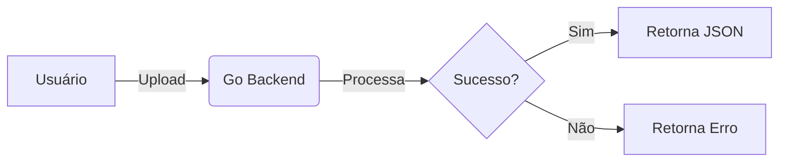

# Decisão de Arquitetura 001: Stack de Documentação

- **Status:** Aceito
- **Data:** 06-01-2026
- **Contexto:** Engenharia & Gestão de Conhecimento

## 1. O Contexto (O Problema)

O projeto _DataProfiler_ nasceu com um desafio atípico para softwares em fase inicial: a **alta densidade de conhecimento prévio**. Diferente de projetos que começam com uma página em branco, iniciamos o desenvolvimento com um legado de conhecimento bruto estimado em mais de **550 páginas** de anotações técnicas, regras de negócio e estudos de viabilidade.

Esse volume massivo de informação trouxe riscos imediatos para a escalabilidade do projeto:

1. **Fragmentação:** O conhecimento estava disperso em arquivos de texto soltos e anotações pessoais, dificultando a consulta rápida ("Onde está aquela regra sobre Regex de CPF?").
2. **Dessincronia:** Manter a documentação separada do código (ex: em um Google Docs ou Word) criaria, inevitavelmente, uma documentação obsoleta. À medida que o código Go evoluísse, o documento estático morreria.
3. **Complexidade de Manutenção:** Gerenciar 550 páginas sem uma estrutura de navegação hierárquica (Menu Lateral, Categorias) tornaria o consumo da informação inviável para novos desenvolvedores ou stakeholders.

### Os Drivers da Decisão (Requisitos)

Para mitigar esses riscos, estabelecemos que a solução de documentação precisaria atender estritamente aos seguintes critérios de arquitetura:

- **Filosofia "Docs as Code":** A documentação deve ser tratada como software. Ela deve viver no mesmo repositório do código fonte, passar por Code Review e ser versionada (Git).
- **Versionamento (Git):** Necessidade de rastrear a evolução das decisões. Se mudarmos a arquitetura do Backend amanhã, a documentação deve ter um _commit_ associado explicando o porquê.
- **Baixa Fricção de Escrita (Markdown):** A ferramenta não poderia exigir conhecimentos complexos de HTML/CSS para escrever uma página simples. O foco deve ser no _conteúdo_, não na diagramação.
- **Suporte a Diagramas:** Devido à complexidade dos fluxos de dados (Streaming, Channels, Goroutines), a ferramenta precisaria renderizar diagramas de arquitetura nativamente (ex: Mermaid.js) sem depender de imagens estáticas `.png` que ficam desatualizadas.

## 2. Opções Consideradas

Para a implementação da estratégia de "Docs as Code", avaliamos as duas principais ferramentas líderes de mercado. A análise focou no equilíbrio entre _manutenibilidade_ (facilidade de manter o sistema rodando) e _produtividade_ (velocidade para migrar as 550 páginas de conteúdo legado).

### Opção A: Docusaurus (Meta/Facebook)

Ferramenta baseada em React/Node.js.

- **Atratividade:** Como nosso Frontend (Client) utiliza React, esta seria a escolha "natural" para manter a stack unificada. Permite customização visual infinita, tratando páginas como componentes.
- **O Bloqueio:** Introduz **complexidade acidental**. O Docusaurus exige que a documentação seja tratada como uma aplicação React completa. Para um projeto onde o foco é organizar regras de negócio complexas, gastar tempo "programando o layout da documentação" foi considerado um desvio de prioridade.

### Opção B: MkDocs + Material Theme (Escolhida)

Ferramenta baseada em Python, configurada via YAML.

- **Atratividade:** Filosofia "Conteúdo Primeiro". O motor transforma arquivos Markdown puros em um site estático sem necessidade de codificação HTML/JS.
- **O Diferencial:** O tema _Material for MkDocs_ oferece nativamente recursos de UX avançados (Busca Instantânea, Dark Mode, Navegação em Abas) que no Docusaurus exigiriam configuração manual ou plugins.

### Critérios de Desempate (Matriz de Decisão)

| Critério                 | Docusaurus (React)         | MkDocs (Python)                     | Vencedor para o DataProfiler |
| :----------------------- | :------------------------- | :---------------------------------- | :--------------------------- |
| **Configuração**         | Imperativa (Code/JSX)      | Declarativa (YAML)                  | **MkDocs**                   |
| **Curva de Aprendizado** | Média (Exige saber React)  | Baixa (Apenas Markdown)             | **MkDocs**                   |
| **Diagramas**            | Plugins externos           | Nativo (Mermaid.js via Superfences) | **MkDocs**                   |
| **Objetivo**             | Criar portais customizados | Organizar conhecimento denso        | **MkDocs**                   |

**Veredito:** A escolha pelo **MkDocs** foi técnica e estratégica. Dado o volume de 550+ tópicos, a prioridade absoluta é a velocidade de escrita e organização hierárquica, sacrificando a liberdade criativa de design em prol de uma estrutura rígida, porém funcional e padronizada.

## 3. A Solução Técnica (Implementação)

A escolha da ferramenta foi apenas o primeiro passo. A implementação prática em ambiente Windows revelou desafios de configuração que poderiam prejudicar a experiência do desenvolvedor (DX) e dificultar o _onboarding_ de novos membros no futuro.

### 3.1 O Desafio do Ambiente (The PATH Saga)

Ao instalar o MkDocs via `pip` no Windows, o executável frequentemente não é adicionado automaticamente às variáveis de ambiente (PATH).

- **O Sintoma:** Ao digitar `mkdocs serve` no terminal, o sistema retornava o erro: _"O termo 'mkdocs' não é reconhecido..."_.
- **A Solução Frágil:** Poderíamos editar manualmente as Variáveis de Ambiente do Windows.
- **O Risco:** Isso cria uma dependência da configuração da máquina local ("Works on my machine"). Se formatarmos o PC, perdemos a capacidade de rodar a doc.

### 3.2 A Camada de Abstração (Makefile)

Para resolver a fragilidade do ambiente, decidimos **não invocar o binário do MkDocs diretamente**. Em vez disso, utilizamos o `Makefile` (já presente no projeto devido ao Go) como um "controle remoto" ou _wrapper_.

Adotamos a estratégia de invocar o módulo Python diretamente (`python -m mkdocs`). Isso garante que, se o Python estiver instalado, a documentação vai rodar, ignorando completamente se o `mkdocs.exe` está no PATH ou não.

### 3.3 Snippet de Implementação

Abaixo, o trecho do `Makefile` que padroniza os comandos de documentação. Note a simplicidade exposta para o usuário final versus a robustez do comando real executado.

```makefile
# ==============================================================================
# DOCUMENTATION (Docs as Code)
# ==============================================================================

# Instala as dependências listadas no requirements.txt (MkDocs + Tema Material + Plugins)
docs-install:
 pip install -r docs/requirements.txt

# Roda o servidor local com Hot-Reload (Atualiza ao salvar o arquivo)
# Uso: python -m mkdocs garante execução mesmo sem PATH configurado no Windows
docs-serve:
 python -m mkdocs serve

# Compila o site estático para a pasta "site/" (Usado antes do deploy)
docs-build:
 python -m mkdocs build

# Faz o deploy manual para o GitHub Pages
docs-deploy:
 python -m mkdocs gh-deploy --force
```

**Resultado**: O desenvolvedor não precisa saber comandos Python ou configurar PATHs complexos. Ele apenas digita make docs-serve e o ambiente funciona. Reduzimos a carga cognitiva e aumentamos a confiabilidade do processo.

## 4. Diagramas e Visualização (Diagrams as Code)

Uma documentação de engenharia robusta depende de fluxogramas e diagramas de arquitetura claros. No entanto, o método tradicional (criar imagens em ferramentas externas como Visio ou Lucidchart, exportar como `.png` e colar no Markdown) gera um **Débito Técnico de Documentação** imediato:

- **Imagens binárias não são versionáveis:** O Git não consegue mostrar o "diff" (o que mudou) dentro de uma imagem PNG.
- **Obsolescência Rápida:** Se a lógica do código muda, o diagrama torna-se "mentiroso" pois o esforço para recriar a imagem é alto.

### 4.1 A Decisão: Mermaid.js

Para resolver isso, adotamos o **Mermaid.js**, uma ferramenta que renderiza gráficos vetoriais diretamente no navegador a partir de definições de texto simples. Isso estende a filosofia "Docs as Code" para a parte visual.

**Comparativo de Manutenção:**

- **Legado (Imagem):** Abrir software gráfico -> Editar -> Exportar -> Substituir arquivo -> Commit.
- **Atual (Mermaid):** Editar texto no Markdown -> Commit.

**Exemplo Prático:**
Ao escrevermos o seguinte bloco de código:

mermaid
graph LR
A[Usuário] -->|Upload| B(Go Backend)
B -->|Processa| C{Sucesso?}
C -->|Sim| D[Retorna JSON]
C -->|Não| E[Retorna Erro]



O MkDocs intercepta esse bloco e desenha o fluxograma automaticamente na tela do usuário final.

### 4.2 Configuração Técnica

Para que o MkDocs entenda essa sintaxe especial (e não a trate como código comum), realizamos duas configurações de infraestrutura:

1. **No Build (`mkdocs.yml`):** Ativação da extensão `pymdownx.superfences`. É ela que permite injetar scripts (como o do Mermaid) dentro de blocos de código cercados (fences).
2. **No Editor (`.vscode/settings.json`):** Ajuste das configurações do workspace para que o _linter_ (verificador de sintaxe) do Markdown entenda que `mermaid` é uma linguagem válida, evitando falsos alertas de erro durante a escrita.

## 5. Estratégia de Deploy (CI/CD)

Para garantir que a documentação esteja acessível globalmente para stakeholders e não apenas na máquina local do desenvolvedor, definimos uma estratégia de publicação baseada em hospedagem estática.

### 5.1 Infraestrutura: GitHub Pages

Optamos pelo **GitHub Pages** como plataforma de hospedagem.

- **Custo Zero:** Integrado ao plano gratuito do GitHub.
- **HTTPS Nativo:** Segurança automática sem configuração de certificados.
- **Separação de Responsabilidades (Branching Strategy):**
  - Branch `main`: Contém a **Fonte da Verdade** (Código Fonte + Markdown Bruto).
  - Branch `gh-pages`: Contém apenas o **Artefato Compilado** (HTML/CSS/JS final). Essa branch é órfã e gerenciada automaticamente pelo script de deploy.

### 5.2 Mecanismo de Deploy (Automação)

Embora o GitHub Actions seja o padrão de mercado para CI/CD, para esta fase inicial do projeto, decidimos, arquiteturalmente, **não** automatizar o deploy a cada _commit_.

**Decisão: Deploy Manual Controlado ("Gatekeeper Strategy")**
Implementamos o comando `make docs-deploy` no Makefile.

- **O Risco da Automação Total:** Um pipeline de "Deploy on Push" publicaria imediatamente qualquer alteração salva. Isso cria o risco de expor rascunhos incompletos, seções "To-Do" ou documentação de funcionalidades que ainda não foram mergeadas no código principal.
- **A Vantagem do Manual:** O deploy manual devolve o controle ao engenheiro. A documentação só é atualizada em produção quando o desenvolvedor explicitamente valida o conteúdo localmente (`make docs-serve`) e decide que a versão está estável para consumo público.

**Comando Técnico:**
O Makefile executa: `python -m mkdocs gh-deploy --force`
_(Nota: A flag `--force` é utilizada intencionalmente para sobrescrever o histórico da branch `gh-pages`, mantendo o repositório leve e focado apenas na versão atual do site)._
