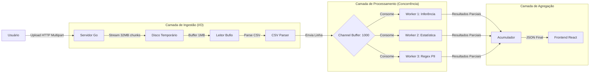

# Arquitetura de Streaming e Performance

Esta seção descreve as decisões de engenharia que permitem ao **DataProfiler** processar arquivos massivos (GBs) mantendo uma pegada de memória mínima (MBs).  
A arquitetura resolve o problema clássico de **Big Data em Hardware Pequeno**.

---

## 🎯 1. O Desafio de Engenharia

Em abordagens tradicionais de Ciência de Dados (como Python/Pandas ou R), o padrão é carregar todo o dataset na memória RAM (_In-Memory Processing_).

!!! danger "Cenário Tradicional"

    - **Arquivo de entrada:** CSV de 10 GB
    - **Infraestrutura:** Container serverless (Render, AWS Lambda) com **512 MB de RAM**
    - **Resultado:** Processo encerrado com erro `OOMKilled` antes da análise começar

!!! success "Abordagem DataProfiler"

    Adotamos uma arquitetura de **Streaming Pipeline**.
    Em vez de carregar o dataset inteiro, os dados são tratados como um **fluxo contínuo**:

    > Lê → Processa → Descarta da memória

## 🔄 2. Pipeline de Processamento

O fluxo de dados segue o padrão **Producer–Consumer**, utilizando as primitivas de concorrência do Go (`Channels` e `Goroutines`).



---

## ⚙️ 3. Tuning de Performance

### Os “Números Mágicos”

A eficiência do sistema depende do ajuste preciso de buffers e limites.
Abaixo estão as principais decisões técnicas.

---

### 📀 3.1 Otimização de I/O de Disco (`bufio`)

Ler dados do disco é uma operação lenta.
A leitura byte a byte gera milhões de _syscalls_, degradando a performance.

=== "Implementação"

    bufio.NewReaderSize(file, 1024\*1024)

=== "Decisão Técnica"

    - Buffer de **1 MB**
    - Reduz drasticamente o número de acessos ao disco
    - Aumenta o throughput de leitura

---

### 📤 3.2 Limite de Upload (Multipart Form)

Uploads grandes podem esgotar a memória do servidor se não houver controle.

=== "Implementação"

    ```go
    r.ParseMultipartForm(32 << 20)
    ```

=== "Decisão Técnica"

    - Apenas **32 MB** permanecem em RAM
    - O excedente é automaticamente escrito em disco
    - Protege o servidor contra uploads de vários GBs

---

### 🚦 3.3 Backpressure (Channel Buffering)

A leitura de disco é mais rápida que o processamento em CPU.
Sem controle, isso pode gerar acúmulo excessivo de dados na memória.

=== "Implementação"

    jobs := make(chan []string, 1000)

=== "Decisão Técnica"

    - Channel com buffer de **1000 linhas**
    - Quando o buffer enche:
      - O leitor de disco é automaticamente bloqueado
    - Cria **backpressure natural**, equilibrando I/O e CPU

!!! info "Resultado"

    O sistema se auto-regula conforme a velocidade do processamento, garantindo estabilidade e previsibilidade.

---

## 🧵 4. Concorrência: Worker Pool

As **goroutines** do Go são extremamente leves (~2 KB), muito menores que threads do sistema operacional (~1 MB).

!!! tip "Estratégia"

    - Um número fixo de _workers_ é iniciado (baseado no número de CPUs)
    - Todos consomem linhas do mesmo channel
    - Se um worker ficar lento (ex.: regex pesada), os outros continuam processando
    **Benefício:**
    ✔️ Melhor uso da CPU
    ✔️ Paralelismo real
    ✔️ Alta escalabilidade com baixo consumo de memória

---

## 📦 5. Distribuição: Binário Único (Embed)

Para simplificar o deploy e eliminar dependências externas (Nginx/Apache), utilizamos o **`embed` do Go (v1.16+)**.

=== "Como Funciona"

    Durante o `go build`, os arquivos estáticos do frontend (React) são embutidos diretamente no binário.
        //go:embed frontend/dist/\*
        var frontendFS embed.FS

=== "Benefícios"

    - Um único arquivo executável
    - Contém:
      - API
      - Pipeline de processamento
      - Interface Web
    - Deploy simples, portátil e previsível

---

!!! success "Resumo Final"

    O DataProfiler combina **streaming**, **concorrência eficiente** e **deploy simplificado** para processar Big Data em ambientes com recursos extremamente limitados.
