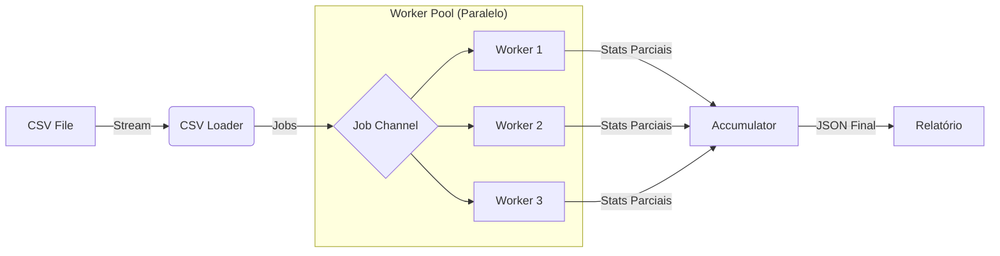

# Engenharia Backend (Go)

O backend do Data Profiler é um motor de alta performance escrito em **Go (Golang)**, projetado para processar arquivos maiores que a memória RAM disponível (_Out-of-Core Processing_).

A arquitetura segue o padrão **Producer-Consumer** utilizando primitivas de concorrência nativas da linguagem (Goroutines e Channels).

---

## 1. Arquitetura de Concorrência

Diferente de abordagens tradicionais que carregam o arquivo inteiro na memória (`ReadAll`), nosso sistema cria um pipeline de processamento contínuo.

<figure>



<figcaption>Figura 1: Fluxo de dentro do Backend</figcaption>
</figure>

### Componentes Principais

| Componente          | Responsabilidade                                                        |
| ------------------- | ----------------------------------------------------------------------- |
| **Infra (Loader)**  | Lê o arquivo linha a linha e envia para o canal. Atua como _Producer_.  |
| **Profiler (Pool)** | Gerencia um conjunto de _Workers_ que processam dados em paralelo.      |
| **Accumulator**     | Centraliza os resultados parciais, evitando _Race Conditions_ críticas. |

---

## 2. Worker Pool e Paralelismo

O coração do sistema é o `Worker Pool`. Ele limita o número de Goroutines ativas para evitar _Context Switching_ excessivo e exaustão de CPU.

O número de workers é definido dinamicamente baseado nas CPUs disponíveis ou via configuração.

```go title="internal/profiler/pool.go"
--8<-- "internal/profiler/pool.go"

```

!!! tip "Cpu Bound vs I/O Bound"

    Como o gargalo do sistema é o processamento de texto (Regex/Parsing) e não a leitura de disco, a estratégia de múltiplos workers escala linearmente com o número de núcleos do processador.

---

## 3. Inferência de Tipos (Core Logic)

A detecção de tipos é feita através de expressões regulares (Regex) otimizadas e compiladas na inicialização do pacote. O sistema tenta inferir o tipo mais específico possível (Int > Float > String).

A lógica é isolada em funções puras para facilitar Testes Unitários e Fuzzing.

```go title="internal/profiler/infer.go"
--8<-- "internal/profiler/infer.go"

```

---

## 4. Estratégia de Streaming (Memória)

Para garantir que o consumo de memória permaneça constante (O(1)) independentemente do tamanho do arquivo, utilizamos `bufio.Scanner` e processamento em chunks.

1. O arquivo é aberto via `multipart.File`.
2. Um `sniff` inicial lê os primeiros 4KB para detectar separadores e encoding.
3. O cursor volta ao início e o streaming começa.

```go title="internal/infra/csv_loader.go"
--8<-- "internal/infra/csv_loader.go"

```

---

## 5. API e Server-Sent Events (SSE)

A comunicação com o frontend não bloqueia a requisição de upload.

1. **Upload Handler:** Recebe o arquivo e despacha uma goroutine `go p.Run()`.
2. **SSE Handler:** Mantém uma conexão HTTP aberta para enviar o progresso calculado pelo `ProgressTracker`.

!!! warning "Graceful Shutdown"

    O servidor utiliza `context.Context` para cancelar o processamento de arquivos caso o cliente encerre a conexão abruptamente, liberando recursos do servidor.

```go title="cmd/api/main.go"
--8<-- "cmd/api/main.go:40:60"

```

(Exemplo de trecho do main.go configurando as rotas)
