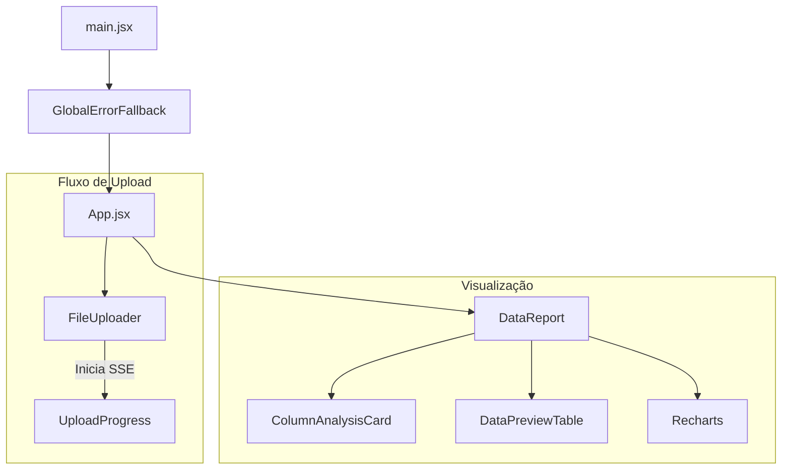

# Engenharia Frontend

A interface do Data Profiler é uma Single Page Application (SPA) moderna, construída para oferecer feedback visual instantâneo durante o processamento de grandes volumes de dados.

A arquitetura prioriza a **densidade de informação** (via DataGrid) e a **reatividade** (via Server-Sent Events), eliminando a necessidade de _polling_ constante.

---

## 1. Stack Tecnológica

As decisões técnicas visam performance de renderização e estabilidade.

| Tecnologia               | Versão | Função                                          |
| :----------------------- | :----- | :---------------------------------------------- |
| **React**                | `19.x` | Biblioteca de UI principal.                     |
| **Vite**                 | `7.x`  | Build tool e Hot Module Replacement (HMR).      |
| **MUI (Material UI)**    | `7.x`  | Design System Enterprise (componentes prontos). |
| **Recharts**             | `3.x`  | Visualização de dados estatísticos.             |
| **React Error Boundary** | `6.x`  | Tratamento global de falhas na UI.              |

!!! tip "Performance de Build"

    O projeto utiliza **SWC** (Rust) no lugar do Babel para transpilação, reduzindo o tempo de build em ambientes de CI/CD.

---

## 2. Arquitetura de Componentes

A aplicação segue uma hierarquia de componentes funcionais. O estado global é minimizado em favor de estados locais e composição.

<figure>



<figcaption>Figura 1: Fluxo dentro do frontend</figcaption>
</figure>

---

## 3. Comunicação Real-Time (SSE)

Para evitar sobrecarga no servidor com requisições HTTP repetidas (_polling_), utilizamos **Server-Sent Events (SSE)**.

1. O cliente faz POST em `/upload`.
2. O servidor retorna `202 Accepted` imediatamente.
3. O cliente abre conexão em `/events`.
4. O servidor envia atualizações de progresso (0-100%) via stream de texto.

!!! warning "Conexões Persistentes"

    O frontend deve gerenciar o ciclo de vida do `EventSource`, fechando a conexão explicitamente ao receber o evento de `complete` ou `error` para evitar vazamento de recursos no navegador.

---

## 4. Integração Single Binary (Embed)

O frontend não é servido por um servidor Node.js separado em produção. Ele é compilado e embutido dentro do binário Go.

O pacote `frontend` utiliza a diretiva `embed` do Go 1.16+ para virtualizar o sistema de arquivos da pasta `dist`.

```go title="frontend/embed.go"
--8<-- "frontend/embed.go"
```

### Processo de Build

1. **Frontend:** `npm run build` gera os arquivos estáticos na pasta `dist/`.
2. **Go:** O compilador lê a diretiva `//go:embed dist/*`.
3. **Resultado:** Um único executável `.exe` contém toda a aplicação React, HTML, CSS e imagens.

---

## 5. Padrões de Código e Linting

O projeto utiliza ESLint com configuração "Flat Config" para garantir a qualidade do código JavaScript/JSX.

```javascript title="eslint.config.js"
--8<-- "frontend/eslint.config.js:15:23"
```
