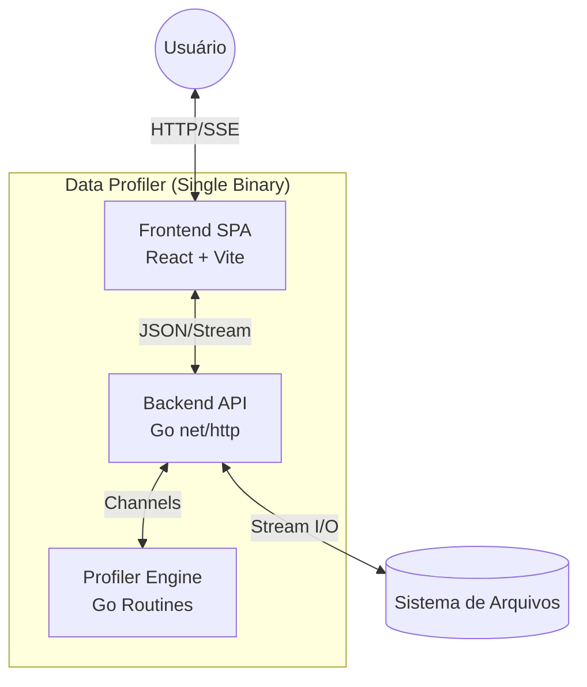

# Visão Geral da Engenharia

O **Data Profiler** é projetado sob uma arquitetura híbrida de alto desempenho, combinando a robustez de sistemas de baixo nível (Go) com a interatividade de interfaces modernas (React).

O objetivo principal da engenharia deste projeto é viabilizar o **Processamento Out-of-Core**: a capacidade de analisar datasets significativamente maiores que a memória RAM disponível na máquina hospedeira.

---

## 1. Diagrama de Contexto (C4 Nível 1)

O sistema opera como um executável monolítico autocontido, eliminando dependências externas (como Runtime Node.js ou Banco de Dados) para a execução padrão.

<figure>

<figcaption>Figura 1: Fluxo do funcionalmente</figcaption>
</figure>

---

## 2. Princípios de Design

### 2.1. Streaming First (Zero Load)

Diferente de abordagens tradicionais que carregam o arquivo inteiro (`ReadAll`), todo o pipeline do Data Profiler é baseado em **Streaming**.

- **Leitura:** O arquivo é lido em chunks de 4KB a 32KB.
- **Processamento:** As linhas fluem por canais (`chan []string`) para workers.
- **Resultado:** As estatísticas são acumuladas incrementalmente, mantendo o consumo de memória O(1).

### 2.2. Feedback Loop em Tempo Real

Processamentos de Big Data podem demorar. Para evitar a sensação de travamento:

- O Backend não bloqueia a requisição HTTP de upload.
- O Frontend utiliza **Server-Sent Events (SSE)** para receber atualizações parciais (0% a 100%).
- O usuário visualiza o progresso linha a linha, não apenas o resultado final.

### 2.3. Distribuição Simplificada

A complexidade da stack (Node.js, Go, Bibliotecas) é abstraída no processo de build.

- O Frontend é compilado estaticamente (`npm run build`).
- Os assets são embutidos no binário Go (`//go:embed`).
- O resultado é um único arquivo `.exe` ou binário Linux que sobe todo o ambiente.

---

## 3. Navegação da Documentação Técnica

Para aprofundar-se em cada camada da aplicação, consulte as seções específicas:

- ## :simple-go: **Backend (Go)**

Entenda a concorrência, o Worker Pool, a inferência de tipos com Regex e a matemática estatística.
[Explorar Backend](backend/index.md)

- ## :simple-react: **Frontend (React)**

Veja a arquitetura de componentes, o consumo de eventos SSE e o Design System com Material UI.
[Explorar Frontend](frontend/index.md)

- ## :material-file-document-edit: **Decisões de Arquitetura (ADR)**

Histórico das decisões técnicas difíceis, trade-offs e escolhas de bibliotecas.
[Ver Decisões](../management/index.md)

---

## 4. Stack Tecnológica

| Camada             | Tecnologia  | Versão    | Propósito                                     |
| ------------------ | ----------- | --------- | --------------------------------------------- |
| **Linguagem Core** | Go (Golang) | `1.23+`   | Performance, Concorrência e Type Safety.      |
| **Interface**      | React       | `19.0`    | Renderização de UI e Gerenciamento de Estado. |
| **Build Tool**     | Vite        | `7.0`     | Bundling rápido e HMR para desenvolvimento.   |
| **Transporte**     | net/http    | Stdlib    | Servidor Web e implementação de SSE.          |
| **Container**      | Docker      | `Compose` | Padronização de ambiente de desenvolvimento.  |
