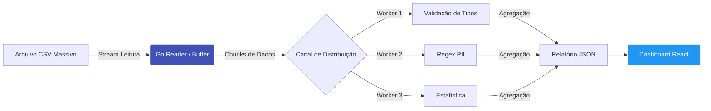

  
  
  <h1>DataProfiler Enterprise</h1>
  

    Análise de Qualidade e Perfilamento de Dados processando <strong>Gigabytes</strong> com consumo mínimo de RAM.
  

  
  

    <a href="guia-usuario/instalacao/" class="md-button md-button--primary">
      🚀 Começar Agora
    </a>
    <a href="engenharia/arquitetura-streaming/" class="md-button md-button--secondary">
      Entender a Engenharia
    </a>
  

<h3 align="center"> O Problema: Big Data vs Hardware Limitado </h3>

  

    <h3>🚀 Alta Performance</h3>
    

      Esqueça o erro <code>Out of Memory</code>. Nossa arquitetura lê arquivos maiores que a RAM disponível, utilizando buffers inteligentes e <strong>I/O não bloqueante</strong>. Processa 10GB com apenas 512MB de RAM.
    

  

  

    <h3>🛡️ SLA Automático</h3>
    

      O sistema classifica automaticamente a qualidade das colunas (<strong>Ouro, Prata, Bronze</strong>) calculando a densidade de informação e consistência em tempo real para tomada de decisão.
    

  

  

    <h3>👁️ Segurança & LGPD</h3>
    

      Detector de <strong>PII (Dados Pessoais)</strong> integrado. O sistema varre e alerta sobre CPF, E-mails e Cartões de Crédito expostos para garantir conformidade.
    

  

  

    <h3>📦 Single Binary</h3>
    

      Zero dependências. O Backend (Go) e o Frontend (React) são compilados em um único arquivo executável <code>.exe</code>. Baixou, rodou, usou.
    

  

  

    <h3>🧠 Inferência Inteligente</h3>
    

      Esqueça o mapeamento manual (`schema`). O algoritmo de <strong>Type Inference</strong> analisa amostras dos dados para detectar automaticamente se a coluna é Inteiro, Decimal, Data ou Texto.
    

  

  

    <h3>📊 Interface & Estatísticas</h3>
    

      Frontend em <strong>React + Material UI</strong>. Oferece DataGrid com paginação nativa, filtros avançados e cálculo automático de estatísticas (Média, Mediana, Desvio Padrão) em tempo real.
    

  

<h3 align="center"> A Engenharia por trás do Streaming</h3>

O diferencial do DataProfiler é a arquitetura <strong>Producer-Consumer</strong>. O dado flui através de canais concorrentes sem nunca ser carregado totalmente na memória.

<h3 align="center">
Pronto para usar?
Não requer Python, Java ou Docker obrigatório.
</h3>

<a href="guia-usuario/instalacao/" class="md-button"> Baixar para Windows (.exe) </a>

<a href="decisoes/001-escolha-documentacao/" class="md-button"> Ver Decisões de Arquitetura (ADR) </a>

