 
<h3 align="center" style="font-weight:300; margin-bottom: 3rem; margin-top: 1rem;">
  Solução definitiva para Big Data em ambientes com Hardware Limitado
</h3>

  

    <h3>🚀 Alta Performance</h3>
    

      Esqueça o erro <code>Out of Memory</code>. Nossa arquitetura lê arquivos maiores que a RAM disponível, utilizando buffers inteligentes e <strong>I/O não bloqueante</strong>. Processa 10GB com apenas 512MB de RAM.
    

  

  

    <h3>🛡️ SLA Automático</h3>
    

      O sistema classifica automaticamente a qualidade das colunas (<strong>Ouro, Prata, Bronze</strong>) calculando a densidade de informação e consistência em tempo real.
    

  

  

    <h3>👁️ Segurança & LGPD</h3>
    

      Detector de <strong>PII (Dados Pessoais)</strong> integrado. O sistema varre e alerta sobre CPF, E-mails e Cartões de Crédito expostos.
    

  

  

    <h3>📦 Single Binary</h3>
    

      Zero dependências. O Backend (Go) e o Frontend (React) são compilados em um único arquivo executável <code>.exe</code>.
    

  

  

    <h3>🧠 Inferência Inteligente</h3>
    

      Esqueça o mapeamento manual. O algoritmo de <strong>Type Inference</strong> analisa amostras dos dados para detectar tipos automaticamente.
    

  

  

    <h3>📊 Interface & Estatísticas</h3>
    

      Frontend em <strong>React + Material UI</strong>. DataGrid com paginação nativa e estatísticas (Média, Desvio Padrão) em tempo real.
    

  

 

 

<h2 align="center" style="font-weight: 800;">A Engenharia por trás do Streaming</h2>

  O diferencial do DataProfiler é a arquitetura <strong>Producer-Consumer</strong>.
  O dado flui através de canais concorrentes sem nunca ser carregado totalmente na memória.

```mermaid

graph LR
    %% --- Definição dos Nós ---
    A[Arquivo CSV Massivo] -->|Stream Leitura| B(Go Reader / Buffer);
    B -->|Chunks de Dados| C{Canal de Distribuição};

    %% Workers paralelos
    C -->|Worker 1| D[Validação de Tipos];
    C -->|Worker 2| E[Regex PII];
    C -->|Worker 3| F[Estatística];

    %% Agregação
    D & E & F -->|Agregação| G[Relatório JSON];
    G --> H[Dashboard React];

    %% --- APLICAÇÃO DE CLASSES CSS EXTERNAS ---
    %% Isso vincula os nós às regras que criamos no home.css
    %% Não definimos cores aqui. O CSS controla tudo.

    class A,B source;
    class C,D,E,F,G process;
    class H target;

    %% Apenas removemos o preenchimento padrão da linha para o CSS pintar
    linkStyle default fill:none;

```

<figure>

<figcaption>Figura 1: Fluxo de Dados na Arquitetura Producer-Consumer</figcaption>
</figure>

  <h2 class="roadmap-title">Jornada de Evolução</h2>

  

    

      <h4>⚙️ Fase 1: O Motor Matemático</h4>
      <ul>
        <li>Core estatístico de alta precisão (Go)</li>
        <li>Inferência de Tipos com Regex Engine</li>
        <li>Arquitetura In-Memory (MVP)</li>
      </ul>
    

    
✓

    

  

  

    

    
✓

    

      <h4>🌊 Fase 2: Streaming & Robustez</h4>
      <ul>
        <li>Pipeline de Leitura (Channels)</li>
        <li>Gestão de Memória (Sync.Pool)</li>
        <li>Observabilidade (Slog & Pprof)</li>
      </ul>
    

  

  

    

      <h4>🨠Fase 3: Experiência Enterprise</h4>
      <ul>
        <li>Interface Material UI (DataGrid)</li>
        <li>Feedback Visual (SSE Real-time)</li>
        <li>Empacotamento Docker & Embed Binary</li>
      </ul>
    

    
✓

    

  

  

    

    
🔮

    

      <h4>O Futuro (Roadmap)</h4>
      <ul>
        <li>Persistência (SQLite/Postgres)</li>
        <li>Cardinalidade (HyperLogLog)</li>
        <li>Exportação de Relatórios PDF</li>
      </ul>
    

  

<h3>Pronto para usar?</h3>

<a href="guide/" class="md-button md-button--primary" style="border-radius: 50px; padding: 0.8rem 2rem; font-weight: bold;"> Baixar para Windows (.exe) </a>

<a href="management/arquitetura/" class="md-button" style="border-radius: 50px; padding: 0.8rem 2rem; margin-left: 1rem;"> Ver Decisões de Arquitetura (ADR) </a>

<h3>👷 Junte-se ao Desenvolvimento</h3>

 Este projeto segue padrões rigorosos de engenharia. Quer contribuir com código ou documentação? Confira nosso Guia de Estilo e Padrões de Commit. 

<a href="CONTRIBUTING/" class="md-button md-button--primary"> Ler Guia de Contribuição </a>

<a href="https://github.com/jgustavocn/dataprofiler" class="md-button"> Ver no GitHub </a>

